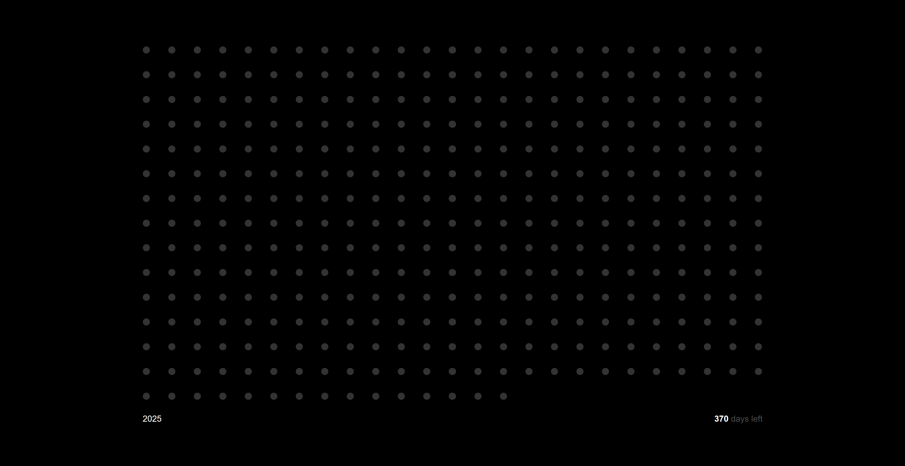

## How to install

Unzip the folder. 

To add this extension go to [chrome://extensions/](chrome://extensions/) and toggle on the developer mode. 

Select "Load unpacked. 

Upload the folder.

Open a new tab in chrome and you should see the following 2025 day counter. 

